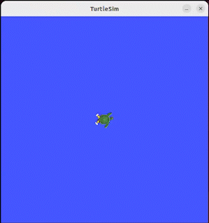

# ROS2-Turtle-Simulator

Implementation of the ROS2 turtlesim package to create a simulation where the main turtle catches spawned turtles.



## Technologies

This project is created with:

- ROS2 Humble
- Python

# Installation

1. Clone the repository

```
$ git clone https://github.com/Lin-Ian/ROS2-Turtle-Simulator.git
```

2. Navigate to ROS2 project directory

```
$ cd turtlesim_project
```

3. Build packages

```
$ colcon build
```

4. Launch application

```
$ ros2 launch my_turtlesim_bringup turtlesim_catch_them_all.launch.py
```

Simulator window will pop up, watch the main turtle catch the spawned turtles. 🐢

5. (Optional) Customize the simulation

- Change the parameters in the launch file
  - Spawn frequency (positive float value)
  - Turtle name prefix (string value)
  - Catch the closest turtle (boolean value)

## Features

- Select the spawning frequency of turtles
- Choose the catching priority (closest turtle or most recently spawned turtle)

## Project Status

Project is: complete

## Sources

The development of the simulator was created alongside the Udemy course
[ROS2 For Beginners (ROS Foxy, Humble - 2022)](https://www.udemy.com/course/ros2-for-beginners/)
